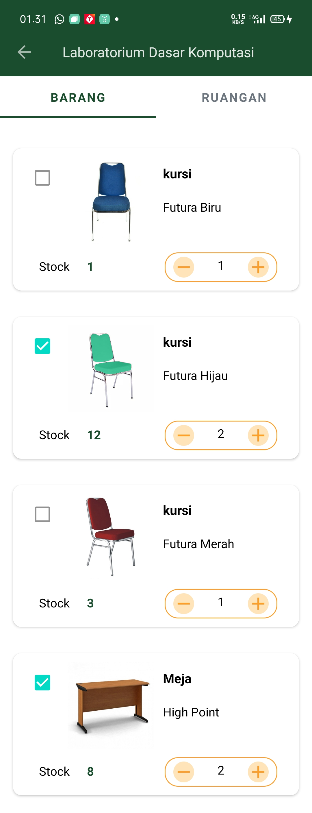
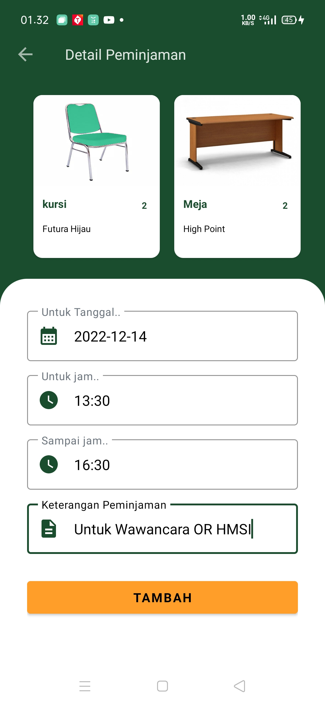
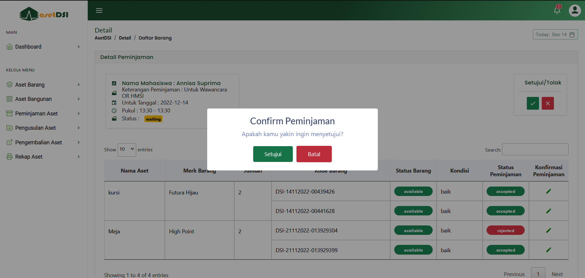
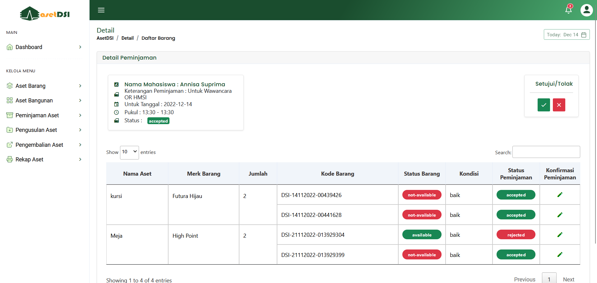

Departemen Sistem Informasi memiliki cukup banyak aset, sehingga dibutuhkan
pengelolaan aset yang maksimal. Saat ini pengelolaan Aset di Departemen Sistem
Informasi seperti proses pengusulan aset dan peminjaman aset masih dilakukan
secara konvensional, dengan cara memberikan surat permintaan pengusulan
ataupun peminjaman kepada penanggung jawab aset yang dituju. Namun, hal ini
tentunya tidak efektif, karena ada kalanya penanggung jawab aset kewalahan
dalam menanggapi proses permintaan yang terlalu banyak, sehingga mengalami
kesulitan dalam mendapatkan informasi mengenai permintaan aset sebelum-
sebelumnya, karena bisa saja surat hilang dan rusak. Untuk mengatasi masalah
tersebut dibangunlah sebuah sistem informasi yang memudahkan admin dan
pengguna dalam melakukan pengelolaan aset, pengusulan aset dan peminjaman
aset secara efektif dan efisien. Sistem informasi ini dikembangkan dengan metode
waterfall dan berjalan pada platform mobile dengan menggunakan sistem operasi
android. Dari hasil pengujian yang telah dilakukan terhadap semua fungsional
pada masing-masing aktor dapat disimpulkan bahwa semua fungsional pada
aplikasi ini berjalan dengan baik. Sehingga, pembangunan sistem informasi
pengusulan dan peminjaman aset berbasis mobile pada departemen sistem
informasi universitas andalas telah berhasil dibangun untuk mengatasi persoalan
terkait proses pengelolaan aset dan proses permintaan peminjaman dan
pengusulan aset pada Departemen Sistem Informasi Universitas Andalas.

Aplikasi ini memiliki beberapa functional diantaranya : 
1. Melakukan peminjaman barang kepada penanggung jawab aset yang bersangkutan melalui mobile

2. Melakukan konfirmasi peminjaman barang melalui website oleh penanggung jawab

---