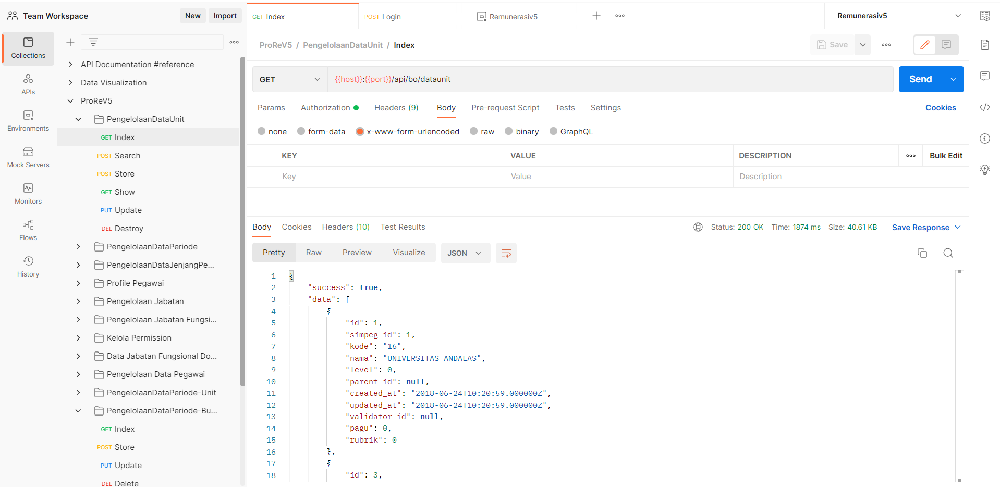

 Pada kesempatan kali ini saya mendapatkan project untuk membangun Rest Api untuk Sistem Informasi Remunerasi yang akan digunakan oleh Universitas Andalas. Disini saya dan tim menggunakan framework laravel, dan database MySQL. Pengujian dilakukan dengan menggunakan Postman. 

Aplikasi ini digunakan untuk sistem penghitungan gaji karyawan pada Universitas Andalas.
Berikut saya lampirkan contoh pengujian menggunakan postman:

---
