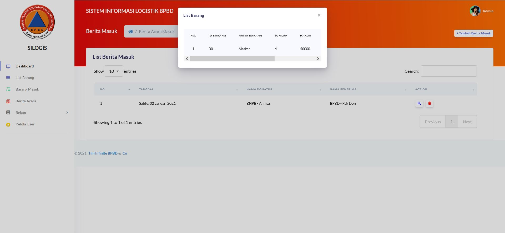
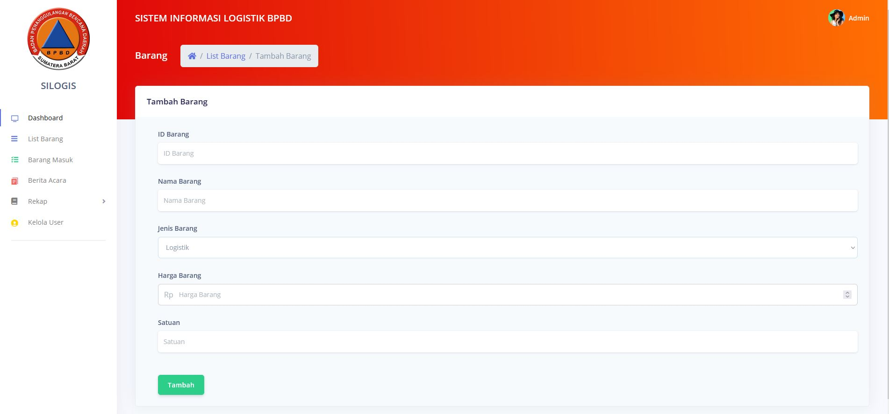

Kantor Badan Penanggulangan Bencana Daerah (BPBD Sumatera Barat)
merupakan instansi pemerintah yang melaksanakan tugas penanggulangan
bencana di daerah Provinsi Sumatera Barat. BPBD Sumatera Barat
melaksanakan kegiatan pencegahan melalui pendekatan hukum dan pengawasan
pelaksanaan dari peraturan perundang-undangan tentang keamanan dan
keselamatan yang berlaku dan melakukan segala upaya kegiatan pelatihan,
penyiapan sarana dan prasarana serta dukungan logistik untuk menghadapi
kemungkinan kegiatan penanganan bencana. Dalam menjalankan kegiatan
tersebut, penerapan teknologi informasi sangatlah krusial, terutama untuk
mengelola informasi yang merupakan aset berharga di era industri 4.0 ini. Pada
saat ini BPBD Sumatera Barat khususnya bidang Kedaruratan dan Logistik yang
memiliki tugas mengkoordinasikan dan melaksanakan kegiatan tanggap darurat
penanggulangan bencana, mengumpulkan data korban dan kerusakan di lokasi
bencana, serta mengelola bantuan logistik masih dilakukan secara manual
melalui Micrososft Excel, untuk itu pengelolaan tersebut dapat di
implementasikan sistem informasi. Oleh karena itu pembuatan aplikasi Sistem
Informasi Logistik atau yang disingkat SILOGIS ini akan sangat membantu dan
memberi kemudahan bagi para pegawai dalam melakukan pengkoordinasisan
dan pengumpulan data yang dibutuhkan, mencetak berita acara serta melakukan
pembukuan atau rekap setiap akhir bulan atau tahunnya. Aplikasi ini dibangun
dengan menggunakan framework Laravel serta DBMS MySQL untuk basis data.
Output yang diharapkan dari pembangunan aplikasi ini adalah mempermudah
pihak BPBD Sumatera Barat dalam pengumpulan data barang ataupun transaksi
barang masuk dan keluar, serta pembuatan rekap berita masuk dan berita keluar
serta print berita acara masuk dan keluar yang ada di organisasi tersebut 

Berikut saya lampirkan beberapa functional aplikasi logistik: 

---